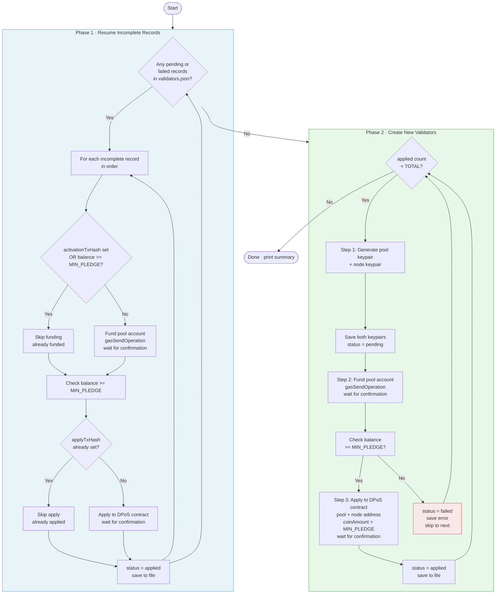
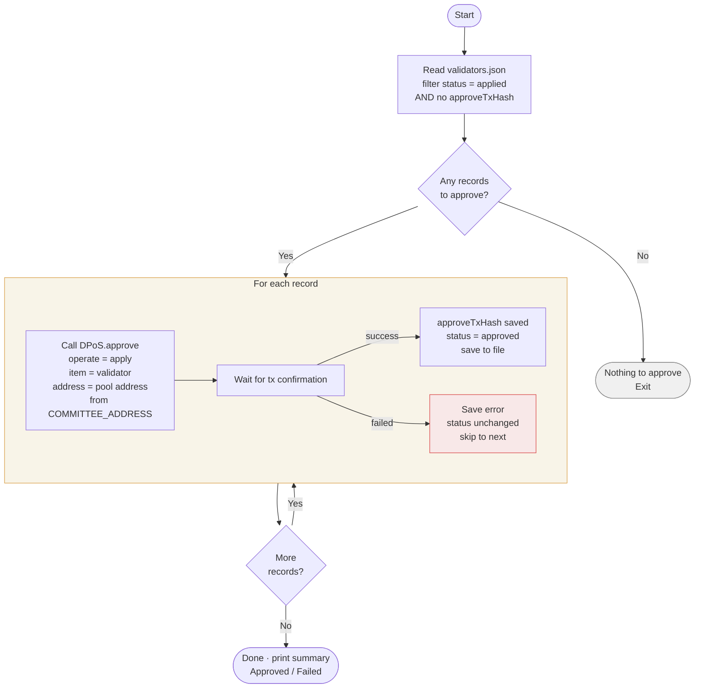
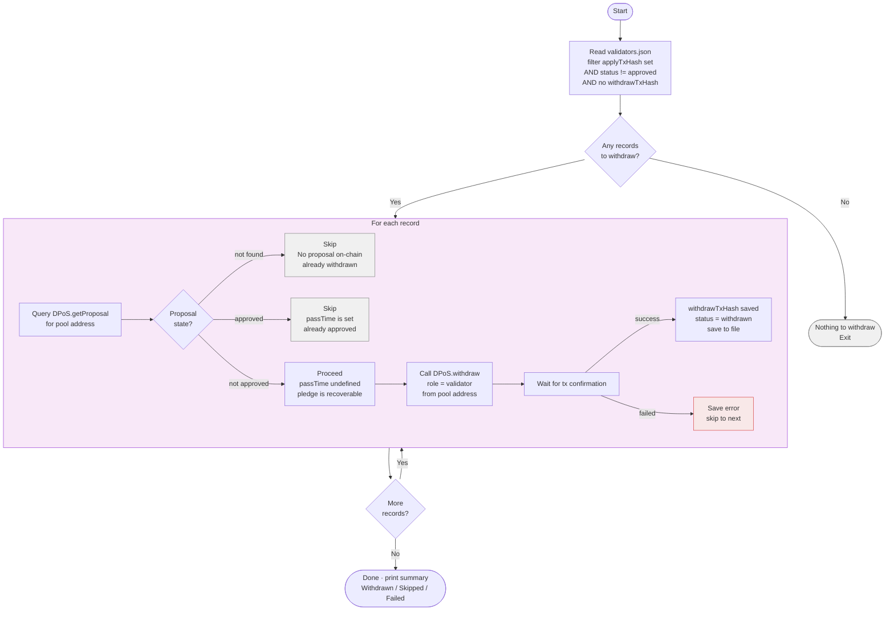

# Validator Registration

Registers validator accounts on the Zetrix DPoS contract in bulk.

For each iteration it:
1. Creates two keypairs — a **pool account** (receives rewards, sends apply tx) and a **node account** (P2P node identity, keypair only)
2. Transfers ZETRIX from the platform (funder) account to the pool account
3. Verifies the pool account balance is sufficient before proceeding
4. Calls the DPoS contract `apply` to register as a validator candidate

All generated accounts and transaction results are saved to `output/validators.json`.

---

## Registration Flow (`register:validators`)



---

## Approval Flow (`approve:validators`)



---

## Withdraw Flow (`withdraw:validators`)



---

## Prerequisites

- Node.js v14 or later
- A funded **platform (funder) account** with enough ZETRIX to cover all registrations
  - Required per validator: `TRANSFER_AMOUNT` + gas fees (~3,000 ZETA)
  - For 337 validators on mainnet: ~33,700,000 ZETRIX total

## Installation

```bash
npm install
```

## Configuration

Copy the example env file and fill in your values:

```bash
cp .env.example .env
```

Edit `.env`:

```env
# Zetrix node host
HOST=node.zetrix.com

# DPoS contract address
# Mainnet:  ZTX3ePNZQhndgGzKLmg1SFfno3N42mLhPYJMN
# Testnet:  ZTX3JsY9qM3VfqKPpoLGKpwnKbtAD92wMd3My
DPOS_CONTRACT=ZTX3ePNZQhndgGzKLmg1SFfno3N42mLhPYJMN

# Minimum pledge per validator in ZETA (1 ZETRIX = 1,000,000 ZETA)
# Mainnet: 100000000000  (100,000 ZETRIX)
# Testnet: 1             (1 ZETA)
MIN_PLEDGE=100000000000

# Total ZETA to transfer to each new pool account
# Must be >= MIN_PLEDGE + gas fees (at least MIN_PLEDGE + ~5,000 ZETA)
# Mainnet: 100000000000  (100,000 ZETRIX)
# Testnet: 10000         (10,000 ZETA)
TRANSFER_AMOUNT=100000000000

# Platform (funder) account — funds each new pool account
FUNDER_ADDRESS=ZTX3xxxxxxxxxxxxxxxxxxxxxxxxxxxxxxxxxxxx
FUNDER_PRIVATE_KEY=privbxxxxxxxxxxxxxxxxxxxxxxxxxxxxxxxxxxxx

# Committee account — approves validator applications (approve:validators)
COMMITTEE_ADDRESS=ZTX3xxxxxxxxxxxxxxxxxxxxxxxxxxxxxxxxxxxx
COMMITTEE_PRIVATE_KEY=privbxxxxxxxxxxxxxxxxxxxxxxxxxxxxxxxxxxxx

# Number of validators to register
TOTAL=337
```

## Scripts

| Command | Description |
|---|---|
| `npm run register:validators` | Create accounts, fund, and apply to DPoS |
| `npm run approve:validators` | Committee approves all applied validators |
| `npm run withdraw:validators` | Reclaim pledges from expired/unapproved proposals |
| `npm run sanity-check` | Verify all records in validators.json |

## Output

Results are saved to `output/validators.json` after **each validator** is processed. Both pool and node keypairs are saved immediately after creation — before any transaction is submitted — so keys are never lost even if a later step fails.

```json
[
  {
    "index": 1,
    "pool": {
      "address": "ZTX3...",
      "privateKey": "privb...",
      "publicKey": "b00..."
    },
    "node": {
      "address": "ZTX3...",
      "privateKey": "privb...",
      "publicKey": "b00..."
    },
    "activationTxHash": "abc123...",
    "applyTxHash": "def456...",
    "approveTxHash": "ghi789...",
    "status": "approved",
    "timestamp": "2026-05-28T10:00:00.000Z"
  }
]
```

| Status | Meaning |
|---|---|
| `pending` | Keypairs generated, not yet funded or applied |
| `applied` | Apply tx submitted, awaiting committee approval |
| `approved` | Committee approved, validator is a candidate |
| `withdrawn` | Pledge reclaimed after expired/unapproved proposal |
| `failed` | A step failed — re-run `register:validators` to retry |

> **Keep `output/validators.json` secure** — it contains private keys for all pool and node accounts.

## Pool vs Node Account

| | Pool Account | Node Account |
|---|---|---|
| Purpose | Receives block rewards, submits apply tx | P2P node identity |
| Funded | Yes — receives `TRANSFER_AMOUNT` | No |
| Used during registration | Yes | Address only (registered in DPoS) |
| Used when running node | No | Yes — configure in node server |

## Resume on Restart

If the script is interrupted (kill, crash, network error), simply re-run it:

```bash
npm run register:validators
```

On startup it automatically scans `validators.json` for any `pending` or `failed` records and completes them first, using the **on-chain balance as the source of truth** to determine which steps were already done.

## Sanity Check

After registration, run the sanity check to verify every record in `validators.json`:

```bash
npm run sanity-check
```

| Check | What it verifies |
|---|---|
| Status | `status === 'applied'` |
| Fields | `pool` and `node` address/key present |
| Pool account | Account exists on-chain |
| Funding tx | Transaction confirmed and `error_code = 0` |
| Apply tx | Transaction confirmed and `error_code = 0` |

> DPoS candidate list is not checked — validators only appear after committee approval.

## Testing on Testnet

```env
HOST=test-node.zetrix.com
DPOS_CONTRACT=ZTX3JsY9qM3VfqKPpoLGKpwnKbtAD92wMd3My
MIN_PLEDGE=1
TRANSFER_AMOUNT=10000
FUNDER_ADDRESS=<your testnet address>
FUNDER_PRIVATE_KEY=<your testnet private key>
COMMITTEE_ADDRESS=<your testnet committee address>
COMMITTEE_PRIVATE_KEY=<your testnet committee private key>
TOTAL=3
```

## Contract Addresses

| Network | DPoS Contract | `validator_min_pledge` |
|---------|--------------|----------------------|
| Mainnet | `ZTX3ePNZQhndgGzKLmg1SFfno3N42mLhPYJMN` | 100,000 ZETRIX |
| Testnet | `ZTX3JsY9qM3VfqKPpoLGKpwnKbtAD92wMd3My` | 1 ZETA |

> The testnet contract (`contracts/dpos-testnet.js`) is a modified version with `validator_min_pledge: 1`, `kol_min_pledge: 1`, `vote_unit: 1`, and `valid_period: 30 days` for easy testing.

## Notes

- Validator applications require **committee approval** before becoming active.
- 1 ZETRIX = 1,000,000 ZETA (base units)
- `TRANSFER_AMOUNT` must be at least `MIN_PLEDGE + ~5,000 ZETA` to cover the pledge and gas fees.
