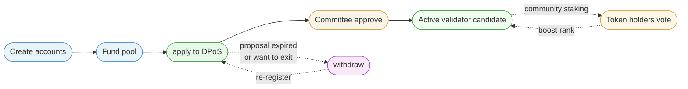
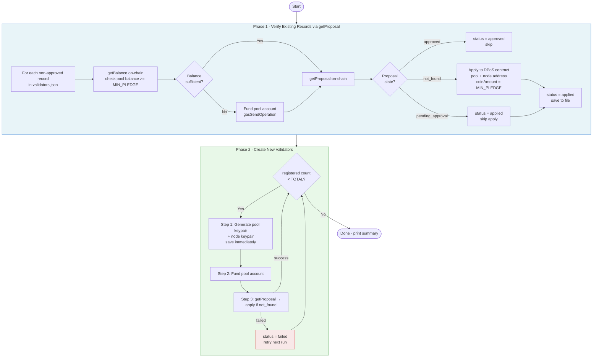
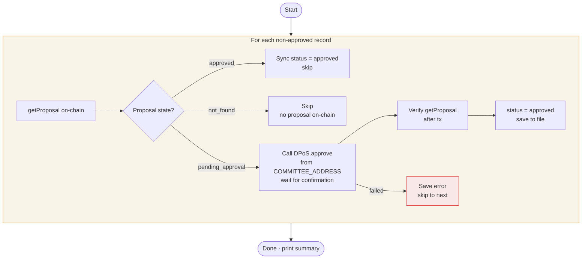
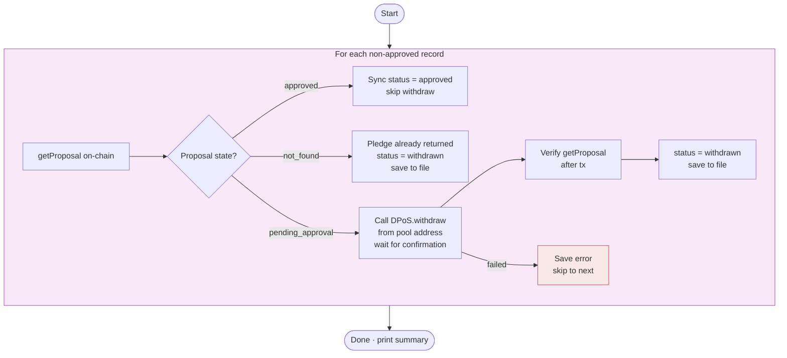
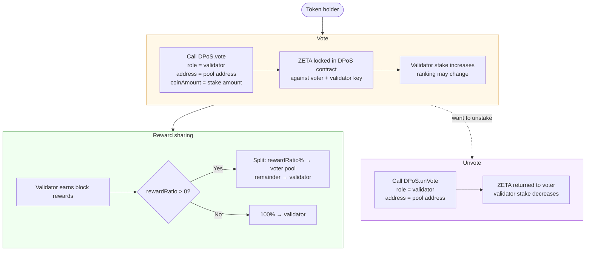

# Validator Registration

Registers validator accounts on the Zetrix DPoS contract in bulk.

For each iteration it:
1. Creates two keypairs — a **pool account** (receives rewards, sends apply tx) and a **node account** (P2P node identity, keypair only)
2. Transfers ZETRIX from the platform (funder) account to the pool account
3. Verifies the pool account balance on-chain before proceeding
4. Calls the DPoS contract `apply` to register as a validator candidate

All generated accounts and transaction results are saved to `output/validators.json`.

> **On-chain first** — every script queries `getProposal` from the DPoS smart contract as the source of truth. Local file status and tx hashes are for reference only and are never used to make decisions.

---

## Overall Lifecycle



---

## Registration Flow (`register:validators`)



---

## Approval Flow (`approve:validators`)



---

## Withdraw Flow (`withdraw:validators`)



---

## Voting Flow (Community Staking)

The DPoS contract allows any ZETA holder to **boost a validator's rank** by staking tokens behind them. This is separate from the registration scripts — done directly via the DPoS contract.



**Key points about voting:**
- Any amount must be a multiple of `vote_unit` (mainnet: 1,000,000,000 ZETA = 1,000 ZETRIX)
- Validators set their `rewardRatio` (0–100%) when applying — how much of their block rewards goes to voters
- Call `unVote` at any time to get your ZETA back
- Stake ranking determines which validators rotate into the active set

---

## Prerequisites

- Node.js v14 or later
- A funded **platform (funder) account** with enough ZETRIX to cover all registrations
  - Required per validator: `TRANSFER_AMOUNT` + gas fees (~3,000 ZETA)
  - For 337 validators on mainnet: ~33,700,000 ZETRIX total

## Installation

```bash
npm install
```

## Configuration

Copy the example env file and fill in your values:

```bash
cp .env.example .env
```

Edit `.env`:

```env
# Zetrix node host
HOST=node.zetrix.com

# DPoS contract address
# Mainnet:  ZTX3ePNZQhndgGzKLmg1SFfno3N42mLhPYJMN
# Testnet:  ZTX3JsY9qM3VfqKPpoLGKpwnKbtAD92wMd3My
DPOS_CONTRACT=ZTX3ePNZQhndgGzKLmg1SFfno3N42mLhPYJMN

# Minimum pledge per validator in ZETA (1 ZETRIX = 1,000,000 ZETA)
# Mainnet: 100000000000  (100,000 ZETRIX)
# Testnet: 1             (1 ZETA)
MIN_PLEDGE=100000000000

# Total ZETA to transfer to each new pool account
# Must be >= MIN_PLEDGE + gas fees (at least MIN_PLEDGE + ~5,000 ZETA)
# Mainnet: 100000000000  (100,000 ZETRIX)
# Testnet: 10000         (10,000 ZETA)
TRANSFER_AMOUNT=100000000000

# Platform (funder) account — funds each new pool account
FUNDER_ADDRESS=ZTX3xxxxxxxxxxxxxxxxxxxxxxxxxxxxxxxxxxxx
FUNDER_PRIVATE_KEY=privbxxxxxxxxxxxxxxxxxxxxxxxxxxxxxxxxxxxx

# Committee account — approves validator applications (approve:validators)
COMMITTEE_ADDRESS=ZTX3xxxxxxxxxxxxxxxxxxxxxxxxxxxxxxxxxxxx
COMMITTEE_PRIVATE_KEY=privbxxxxxxxxxxxxxxxxxxxxxxxxxxxxxxxxxxxx

# Number of validators to register
TOTAL=337
```

## Scripts

| Command | Description |
|---|---|
| `npm run register:validators` | Create accounts, fund, and apply to DPoS |
| `npm run approve:validators` | Committee approves all applied validators |
| `npm run withdraw:validators` | Reclaim pledges from unapproved proposals |
| `npm run sanity-check` | Verify all records against on-chain state |

## Output

Results are saved to `output/validators.json`. Both pool and node keypairs are saved immediately after creation — before any transaction — so keys are never lost.

```json
[
  {
    "index": 1,
    "pool": { "address": "ZTX3...", "privateKey": "privb...", "publicKey": "b00..." },
    "node": { "address": "ZTX3...", "privateKey": "privb...", "publicKey": "b00..." },
    "activationTxHash": "abc123...",
    "applyTxHash": "def456...",
    "approveTxHash": "ghi789...",
    "poolBalance": "9997",
    "status": "approved",
    "timestamp": "2026-05-29T10:00:00.000Z"
  }
]
```

| Status | Meaning |
|---|---|
| `pending` | Keypairs generated, not yet funded or applied |
| `applied` | Registered in DPoS, awaiting committee approval |
| `approved` | Committee approved, active validator candidate |
| `withdrawn` | Pledge reclaimed, can re-register |
| `failed` | A step failed — re-run `register:validators` to retry |

> **Keep `output/validators.json` secure** — it contains private keys for all pool and node accounts.

## Pool vs Node Account

| | Pool Account | Node Account |
|---|---|---|
| Purpose | Receives block rewards, submits apply tx | P2P node identity |
| Funded | Yes — receives `TRANSFER_AMOUNT` | No |
| Used during registration | Yes | Address only (registered in DPoS) |
| Used when running node | No | Yes — configure in node server |

## Sanity Check

```bash
npm run sanity-check
```

Queries `getProposal` and `getBalance` from the blockchain for every record. Auto-updates local status in `validators.json` if on-chain state differs.

| On-chain state | Expected local status |
|---|---|
| `pending_approval` | `applied` |
| `approved` | `approved` |
| `not_found` | `withdrawn` |

## Testing on Testnet

```env
HOST=test-node.zetrix.com
DPOS_CONTRACT=ZTX3JsY9qM3VfqKPpoLGKpwnKbtAD92wMd3My
MIN_PLEDGE=1
TRANSFER_AMOUNT=10000
FUNDER_ADDRESS=<your testnet address>
FUNDER_PRIVATE_KEY=<your testnet private key>
COMMITTEE_ADDRESS=<your testnet committee address>
COMMITTEE_PRIVATE_KEY=<your testnet committee private key>
TOTAL=3
```

## Contract Addresses

| Network | DPoS Contract | `validator_min_pledge` |
|---------|--------------|----------------------|
| Mainnet | `ZTX3ePNZQhndgGzKLmg1SFfno3N42mLhPYJMN` | 100,000 ZETRIX |
| Testnet | `ZTX3JsY9qM3VfqKPpoLGKpwnKbtAD92wMd3My` | 1 ZETA |

> The testnet contract (`contracts/dpos-testnet.js`) has `validator_min_pledge: 1`, `kol_min_pledge: 1`, `vote_unit: 1`, and `valid_period: 30 days`.

## Notes

- Validator applications require **committee approval** before becoming active.
- 1 ZETRIX = 1,000,000 ZETA (base units)
- `TRANSFER_AMOUNT` must be at least `MIN_PLEDGE + ~5,000 ZETA` to cover pledge and gas fees.
- Voting boosts a validator's stake rank but does not replace committee approval.
