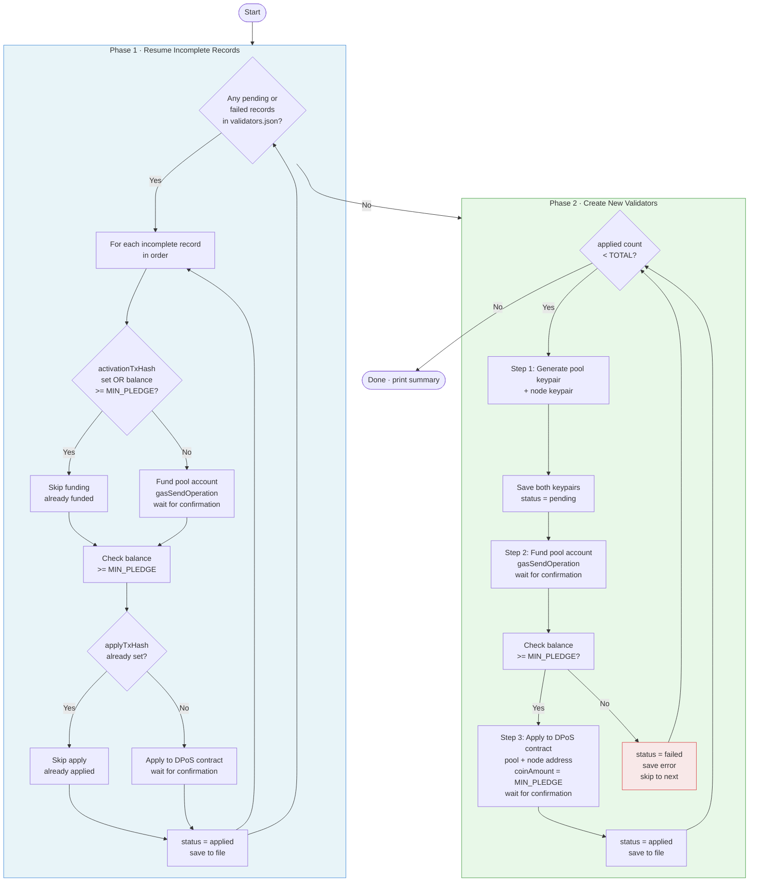

# Validator Registration

Registers validator accounts on the Zetrix DPoS contract in bulk.

For each iteration it:
1. Creates two keypairs — a **pool account** (receives rewards, sends apply tx) and a **node account** (P2P node identity, keypair only)
2. Transfers ZETRIX from the platform (funder) account to the pool account
3. Verifies the pool account balance is sufficient before proceeding
4. Calls the DPoS contract `apply` to register as a validator candidate

All generated accounts and transaction results are saved to `output/validators.json`.

## Flow Diagram



## Prerequisites

- Node.js v14 or later
- A funded **platform (funder) account** with enough ZETRIX to cover all registrations
  - Required per validator: `TRANSFER_AMOUNT` + gas fees (~3,000 ZETA)
  - For 337 validators on mainnet: ~33,700,000 ZETRIX total

## Installation

```bash
npm install
```

## Configuration

Copy the example env file and fill in your values:

```bash
cp .env.example .env
```

Edit `.env`:

```env
# Zetrix node host
HOST=node.zetrix.com

# DPoS contract address
# Mainnet:  ZTX3ePNZQhndgGzKLmg1SFfno3N42mLhPYJMN
# Testnet:  ZTX3JsY9qM3VfqKPpoLGKpwnKbtAD92wMd3My
DPOS_CONTRACT=ZTX3ePNZQhndgGzKLmg1SFfno3N42mLhPYJMN

# Minimum pledge per validator in ZETA (1 ZETRIX = 1,000,000 ZETA)
# Mainnet: 100000000000  (100,000 ZETRIX)
# Testnet: 1             (1 ZETA)
MIN_PLEDGE=100000000000

# Total ZETA to transfer to each new pool account
# Must be >= MIN_PLEDGE + gas fees (at least MIN_PLEDGE + ~5,000 ZETA)
# Mainnet: 100000000000  (100,000 ZETRIX)
# Testnet: 10000         (10,000 ZETA)
TRANSFER_AMOUNT=100000000000

# Platform (funder) account — funds each new pool account
FUNDER_ADDRESS=ZTX3xxxxxxxxxxxxxxxxxxxxxxxxxxxxxxxxxxxx
FUNDER_PRIVATE_KEY=privbxxxxxxxxxxxxxxxxxxxxxxxxxxxxxxxxxxxx

# Number of validators to register
TOTAL=337
```

## Run

```bash
npm run register:validators
```

Console output example:
```
Found 2 incomplete record(s) from previous run — resuming...

── Resuming Validator 1 (status: pending) ──────────────────
  [2] Funding pool account ZTX3abc... with 100000000000 ZETA...
    Funding tx: a1b2c3...
    Pool balance: 100000000000 ZETA
  [3] Applying as validator (pool: ZTX3abc..., node: ZTX3xyz...)...
    Apply tx: d4e5f6...
  Done ✓

Creating 335 new validator(s)...

── Validator 3/337 ──────────────────────────────
  [1] Creating pool and node accounts...
    Pool: ZTX3def...
    Node: ZTX3ghi...
  [2] Funding pool account ZTX3def... with 100000000000 ZETA...
    Funding tx: e5f6g7...
    Pool balance: 100000000000 ZETA
  [3] Applying as validator (pool: ZTX3def..., node: ZTX3ghi...)...
    Apply tx: h8i9j0...
  Done ✓
```

## Output

Results are saved to `output/validators.json` after **each validator** is processed. Both pool and node keypairs are saved immediately after creation — before any transaction is submitted — so keys are never lost even if a later step fails.

```json
[
  {
    "index": 1,
    "pool": {
      "address": "ZTX3...",
      "privateKey": "privb...",
      "publicKey": "b00..."
    },
    "node": {
      "address": "ZTX3...",
      "privateKey": "privb...",
      "publicKey": "b00..."
    },
    "activationTxHash": "abc123...",
    "applyTxHash": "def456...",
    "status": "applied",
    "timestamp": "2026-05-28T10:00:00.000Z"
  }
]
```

> **Keep `output/validators.json` secure** — it contains private keys for all pool and node accounts.

## Pool vs Node Account

| | Pool Account | Node Account |
|---|---|---|
| Purpose | Receives block rewards, submits apply tx | P2P node identity |
| Funded | Yes — receives `TRANSFER_AMOUNT` | No |
| Used during registration | Yes | Address only (registered in DPoS) |
| Used when running node | No | Yes — configure in node server |

## Resume on Restart

If the script is interrupted (kill, crash, network error), simply re-run it:

```bash
npm run register:validators
```

On startup it automatically scans `validators.json` for any `pending` or `failed` records and completes them first, using the **on-chain balance as the source of truth** to determine which steps were already done:

| State | What the script does |
|---|---|
| Keys saved, not funded | Fund pool → apply |
| Funded (balance ok), not applied | Skip funding → apply only |
| Funding tx recorded, not applied | Skip funding → apply only |
| Both txs recorded, status not applied | Mark as applied |
| Fully applied | Skip entirely |

## Approve Validators (Committee)

After validators have applied (`status: applied`), a committee member must approve each one. Add the committee credentials to `.env`:

```env
COMMITTEE_ADDRESS=ZTX3xxxxxxxxxxxxxxxxxxxxxxxxxxxxxxxxxxxx
COMMITTEE_PRIVATE_KEY=privbxxxxxxxxxxxxxxxxxxxxxxxxxxxxxxxxxxxx
```

Then run:

```bash
npm run approve:validators
```

The script reads `validators.json`, approves every record with `status: applied` that doesn't yet have an `approveTxHash`, and saves the result back:

```
Approve validators — committee: ZTX3abc...
Records to approve: 337 of 337

── Approving Validator 1 — pool: ZTX3def...
    Approve tx: a1b2c3...
  Done ✓

── Approving Validator 2 — pool: ZTX3ghi...
    Approve tx: d4e5f6...
  Done ✓

Completed. Approved: 337 | Failed: 0
```

After approval, records are updated with `approveTxHash` and `status: approved`. If interrupted, re-running skips already-approved records automatically.

## Sanity Check

After registration, run the sanity check to verify every record in `validators.json`:

```bash
npm run sanity-check
```

It checks each record for:

| Check | What it verifies |
|---|---|
| Status | `status === 'applied'` |
| Fields | `pool` and `node` address/key present |
| Pool account | Account exists on-chain |
| Funding tx | Transaction confirmed and `error_code = 0` |
| Apply tx | Transaction confirmed and `error_code = 0` |

> DPoS candidate list is not checked here — newly applied validators won't appear until committee approves them.

Output example:
```
Sanity check — 337 record(s) in ./output/validators.json
Host: node.zetrix.com
DPoS contract: ZTX3ePNZQhndgGzKLmg1SFfno3N42mLhPYJMN

Fetching DPoS candidate list... 337 candidate(s) found

  ✓ [1] pool: ZTX3abc...
  ✓ [2] pool: ZTX3def...
  ✗ [3] pool: ZTX3ghi...
  ✓ [4] pool: ZTX3jkl...
  ...

────────────────────────────────────────────────────────────
Result: 336/337 passed

Problems found (1):

  ✗ [3] pool: ZTX3ghi... | node: ZTX3xyz...
       → status is 'failed'
       → apply tx: tx not found (11)
       → pool not found in DPoS candidates
       → node not found in DPoS candidates
```

Any record with problems can be fixed by re-running `register:validators` — the auto-resume will pick up the failed entries automatically.

## Testing on Testnet

Use the following `.env` to test against testnet with minimal amounts:

```env
HOST=test-node.zetrix.com
DPOS_CONTRACT=ZTX3JsY9qM3VfqKPpoLGKpwnKbtAD92wMd3My
MIN_PLEDGE=1
TRANSFER_AMOUNT=10000
FUNDER_ADDRESS=<your testnet address>
FUNDER_PRIVATE_KEY=<your testnet private key>
TOTAL=3
```

Then run:

```bash
npm run register:validators
```

## Contract Addresses

| Network | DPoS Contract | `validator_min_pledge` |
|---------|--------------|----------------------|
| Mainnet | `ZTX3ePNZQhndgGzKLmg1SFfno3N42mLhPYJMN` | 100,000 ZETRIX |
| Testnet | `ZTX3JsY9qM3VfqKPpoLGKpwnKbtAD92wMd3My` | 1 ZETA |

> The testnet contract (`contracts/dpos-testnet.js`) is a modified version with `validator_min_pledge: 1`, `kol_min_pledge: 1`, and `vote_unit: 1` for easy testing.

## Notes

- Validator applications require **committee approval** before becoming active.
- After applying, a committee member must call `approve` on the DPoS contract to admit each validator.
- 1 ZETRIX = 1,000,000 ZETA (base units)
- `TRANSFER_AMOUNT` must be at least `MIN_PLEDGE + ~5,000 ZETA` to cover the pledge and gas fees.
