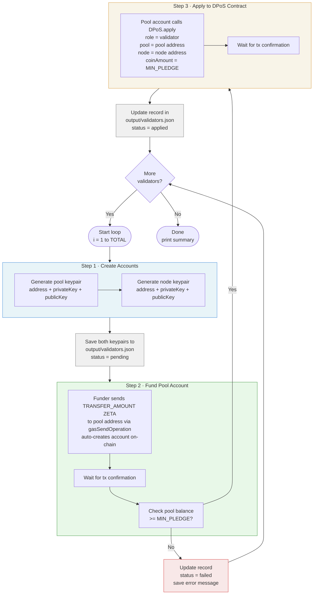

# Validator Registration

Registers validator accounts on the Zetrix DPoS contract in bulk.

For each iteration it:
1. Creates two keypairs — a **pool account** (receives rewards, sends apply tx) and a **node account** (P2P node identity, keypair only)
2. Transfers ZETRIX from the platform (funder) account to the pool account
3. Verifies the pool account balance is sufficient before proceeding
4. Calls the DPoS contract `apply` to register as a validator candidate

All generated accounts and transaction results are saved to `output/validators.json`.

## Flow Diagram



## Prerequisites

- Node.js v14 or later
- A funded **platform (funder) account** with enough ZETRIX to cover all registrations
  - Required per validator: `TRANSFER_AMOUNT` + gas fees (~3,000 ZETA)
  - For 337 validators on mainnet: ~33,700,000 ZETRIX total

## Installation

```bash
npm install
```

## Configuration

Copy the example env file and fill in your values:

```bash
cp .env.example .env
```

Edit `.env`:

```env
# Zetrix node host
HOST=node.zetrix.com

# DPoS contract address
# Mainnet:  ZTX3ePNZQhndgGzKLmg1SFfno3N42mLhPYJMN
# Testnet:  ZTX3JsY9qM3VfqKPpoLGKpwnKbtAD92wMd3My
DPOS_CONTRACT=ZTX3ePNZQhndgGzKLmg1SFfno3N42mLhPYJMN

# Minimum pledge per validator in ZETA (1 ZETRIX = 1,000,000 ZETA)
# Mainnet: 100000000000  (100,000 ZETRIX)
# Testnet: 1             (1 ZETA)
MIN_PLEDGE=100000000000

# Total ZETA to transfer to each new pool account
# Must be >= MIN_PLEDGE + gas fees (at least MIN_PLEDGE + ~5,000 ZETA)
# Mainnet: 100000000000  (100,000 ZETRIX)
# Testnet: 10000         (10,000 ZETA)
TRANSFER_AMOUNT=100000000000

# Platform (funder) account — funds each new pool account
FUNDER_ADDRESS=ZTX3xxxxxxxxxxxxxxxxxxxxxxxxxxxxxxxxxxxx
FUNDER_PRIVATE_KEY=privbxxxxxxxxxxxxxxxxxxxxxxxxxxxxxxxxxxxx

# Number of validators to register (default: 337)
TOTAL=337

# Resume from a specific index if a previous run was interrupted (default: 1)
START_INDEX=1
```

## Run

```bash
npm run register:validators
```

Console output example:
```
── Validator 1/337 ──────────────────────────────
  [1] Creating pool and node accounts...
    Pool: ZTX3abc...
    Node: ZTX3xyz...
  [2] Funding pool account ZTX3abc... with 100000000000 ZETA...
    Funding tx: a1b2c3...
    Pool balance: 100000000000 ZETA
  [3] Applying as validator (pool: ZTX3abc..., node: ZTX3xyz...)...
    Apply tx: d4e5f6...
  Done ✓
```

## Output

Results are saved to `output/validators.json` after **each validator** is processed. Both pool and node keypairs are saved immediately after creation — before any transaction is submitted — so keys are never lost even if a later step fails.

```json
[
  {
    "index": 1,
    "pool": {
      "address": "ZTX3...",
      "privateKey": "privb...",
      "publicKey": "b00..."
    },
    "node": {
      "address": "ZTX3...",
      "privateKey": "privb...",
      "publicKey": "b00..."
    },
    "activationTxHash": "abc123...",
    "applyTxHash": "def456...",
    "status": "applied",
    "timestamp": "2026-05-28T10:00:00.000Z"
  }
]
```

> **Keep `output/validators.json` secure** — it contains private keys for all pool and node accounts.

## Pool vs Node Account

| | Pool Account | Node Account |
|---|---|---|
| Purpose | Receives block rewards, submits apply tx | P2P node identity |
| Funded | Yes — receives `TRANSFER_AMOUNT` | No |
| Used during registration | Yes | Address only (registered in DPoS) |
| Used when running node | No | Yes — configure in node server |

## Resuming an Interrupted Run

If the script stops midway, set `START_INDEX` in `.env` to the index of the last failed entry and re-run:

```bash
START_INDEX=50 npm run register:validators
```

Already-completed entries in `output/validators.json` are preserved.

## Testing on Testnet

Use the following `.env` to test against testnet with minimal amounts:

```env
HOST=test-node.zetrix.com
DPOS_CONTRACT=ZTX3JsY9qM3VfqKPpoLGKpwnKbtAD92wMd3My
MIN_PLEDGE=1
TRANSFER_AMOUNT=10000
FUNDER_ADDRESS=<your testnet address>
FUNDER_PRIVATE_KEY=<your testnet private key>
TOTAL=3
START_INDEX=1
```

Then run:

```bash
npm run register:validators
```

## Contract Addresses

| Network | DPoS Contract | `validator_min_pledge` |
|---------|--------------|----------------------|
| Mainnet | `ZTX3ePNZQhndgGzKLmg1SFfno3N42mLhPYJMN` | 100,000 ZETRIX |
| Testnet | `ZTX3JsY9qM3VfqKPpoLGKpwnKbtAD92wMd3My` | 1 ZETA |

> The testnet contract (`contracts/dpos-testnet.js`) is a modified version with `validator_min_pledge: 1`, `kol_min_pledge: 1`, and `vote_unit: 1` for easy testing.

## Notes

- Validator applications require **committee approval** before becoming active.
- After applying, a committee member must call `approve` on the DPoS contract to admit each validator.
- 1 ZETRIX = 1,000,000 ZETA (base units)
- `TRANSFER_AMOUNT` must be at least `MIN_PLEDGE + ~5,000 ZETA` to cover the pledge and gas fees for the apply transaction.
